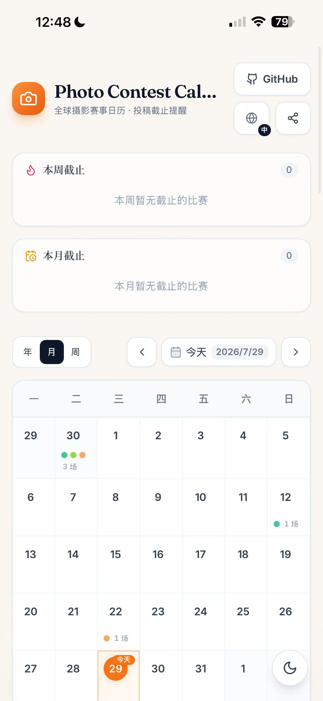

> 🌐 Languages: [中文](./README.zh-CN.md) · [English](./README.md)

# 📸 Never Miss a Deadline · Global Photography Contest Calendar

  
  

An **open-source, backend-free, login-free** reminder tool for photography contest deadlines worldwide. Using year / month / week views, it lays out the submission deadlines of well-known global photography contests at a glance, and flashes cards to remind you which submissions are closing this week / this month.

Live site: `https://hairuoliu.github.io/photo-contest-calendar/`

> Purpose: to let anyone who loves photography treat this site / repo as a **reminder tool for photo contests** — whether you arrive from the official site or browse this list directly on GitHub.

---

## How to use

### On the web
- **Three views**: Year / Month / Week. The view switcher and the "Today / Prev / Next" navigation sit right above the calendar.
  - **Year view**: 12 mini month-calendars with deadline dots — survey the whole year at a glance.
  - **Month view**: full calendar + deadline dots; hover a day to pop a preview bubble of that day's contests.
  - **Week view**: this week's submission deadlines at a glance.
- **This week / This month deadline panels**: pinned on first paint; one tap jumps to the corresponding week view to see near-term closing contests clearly.

### Use it as an App on mobile (Add to Home Screen)
This site is a lightweight **PWA (Progressive Web App)**: no app store needed — once "added to Home Screen", it opens full-screen like a native app, with an icon and offline cache.

**iPhone / iPad (Safari)**
1. Open `https://hairuoliu.github.io/photo-contest-calendar/`.
2. Tap the **Share button** (⬆️ box-with-arrow icon) on the bottom toolbar.
3. In the menu that pops up, swipe up, find and tap **"Add to Home Screen"**.
4. You can rename it (default "Photo Contest Calendar") and tap **Add**.
5. An icon appears on the home screen; tap it to open full-screen, just like an app.

**Android (Chrome / Edge)**
- **One-tap install**: after opening the page, if an "Install app" prompt appears at the bottom, tap **Install** directly; or tap **⋮ → Install app / Add to Home Screen** on the right of the address bar.
- An icon then appears on the home screen; tap to open the full-screen "App".

> Once running in "installed" mode (standalone), the site auto-detects it and the top guidance banner no longer appears.

### Mobile interaction: day-cell bottom sheet
In the month view, **tap any day** → a drawer slides up from the bottom of the screen, listing that day's closing contests in place (reusing the contest card), dimming the background; tap the overlay or **swipe down** to close. This lets you **see the content without leaving the month calendar**, solving the pain of "only seeing a small dot, having to tap in to see anything, and being kicked away from the calendar". The sheet adapts to the safe area, and the close button and card action areas meet the thumb hotspot (≥ 44px).

---

## Included photography contests & events

The list below is generated directly from the data source — **59 contests total** (43 with confirmed deadlines, 16 pending announcement). Sorted by deadline for easy lookup. Some 2026 contest deadlines have already passed — the site auto-marks them "closed" in grey / red, while the list keeps the full history for reference. All dates are best-effort per official announcements.

> Note: "Free" means submission itself is free; a monetary amount means an entry fee applies. Tier: ★ Elite / ◉ Major (blank = regular). Links point to each contest's official site.

| Contest | 中文名 | Deadline | Category | Region | Fee | Tier | Site |
| --- | --- | --- | --- | --- | --- | --- | --- |
| Aesthetica Art Prize 2026 | 2026 Aesthetica 艺术奖 | 2026-10-31 | Abstract | UK | £18 |  | [link](https://aestheticamagazine.com/) |
| All About Photo Awards 2026 | 2026 All About Photo 摄影奖 | 2026-01-27 | Open | Global | $30 |  | [link](https://www.all-about-photo.com/) |
| Aperture Portfolio Prize 2026 | 2026 Aperture 画册奖 | 2026-12-15 | Open | USA | $25 |  | [link](https://aperture.org/) |
| BigPicture Natural World Photography Competition 2026 | 2026 BigPicture 自然世界摄影大赛 | 2026-03-01 | Nature | Global | $25 |  | [link](https://www.bigpicturecompetition.org/) |
| Der Greif Open Call 2026 | 2026 Der Greif 摄影杂志公开征集 | 2026-09-30 | Open | Germany | Free |  | [link](https://www.dergreif.org/) |
| Fisheye Magazine Open Call 2026 | 2026 Fisheye 摄影杂志公开征集 | 2026-10-15 | Open | France | €15 |  | [link](https://www.fisheyemagazine.fr/) |
| Foam Talent 2026 | 2026 Foam 新锐摄影展 | 2026-09-01 | Open | Netherlands | Free |  | [link](https://www.foam.org/) |
| LensCulture Portrait Awards 2026 | 2026 LensCulture 肖像摄影奖 | 2026-02-24 | Portrait | Global | Free |  | [link](https://www.lensculture.com/photo-competitions/portrait-awards) |
| LensCulture Street Photography Awards 2026 | 2026 LensCulture 街头摄影奖 | 2026-06-17 | Street | Global | Free |  | [link](https://www.lensculture.com/photo-competitions/street-photography-awards) |
| LensCulture Critics' Choice 2026 | 2026 LensCulture 评论家之选 | 2026-04-22 | Open | Global | Free |  | [link](https://www.lensculture.com/photo-competitions/critics-choice) |
| MonoVisions Photography Awards 2026 | 2026 MonoVisions 黑白摄影奖 | 2026-05-17 | Abstract | Global | $20 |  | [link](https://monovisionsawards.com/) |
| iPhone Photography Awards 2026 | 2026 iPhone 摄影奖 | 2026-03-31 | Mobile | Global | $25 |  | [link](https://www.ippawards.com) |
| World Press Photo Contest 2026 | 2026 世界新闻摄影比赛 | 2026-01-17 | Documentary | Global | Free |  | [link](https://www.worldpressphoto.org/contest/2026) |
| World Nature Photography Awards 2026 | 2026 世界自然摄影奖 | 2026-06-30 | Nature | Global | $30 |  | [link](https://www.worldnaturephotographyawards.com/) |
| ND Awards 2026 | 2026 中性密度摄影奖 | 2026-09-20 | Open | Global | $20 |  | [link](https://www.ndawards.net/) |
| Canon Photo Contest 2026 | 2026 佳能国际摄影大赛 | 2026-09-30 | Open | Japan | Free |  | [link](https://global.canon/en/photocontest/) |
| Monochrome Awards 2026 | 2026 单色摄影奖 | 2026-11-15 | Abstract | Global | $25 |  | [link](https://monoawards.com/) |
| Smithsonian Magazine Photo Contest 2026 | 2026 史密森尼摄影大赛 | 2026-12-01 | Open | Global | Free |  | [link](https://photocontest.smithsonianmag.com/photocontest/) |
| HIPA 15th Season (Family) 2026 | 2026 哈姆丹国际摄影奖 | 2026-05-31 | Open | Global | Free |  | [link](https://www.hipa.ae) |
| International Photography Awards (IPA) 2026 | 2026 国际摄影奖 | 2026-06-30 | Open | Global | $35 |  | [link](https://www.photoawards.com) |
| Audubon Photography Awards 2026 | 2026 奥杜邦鸟类摄影奖 | 2026-03-04 | Wildlife | Global | $15 |  | [link](https://www.audubon.org/photography/awards) |
| FUJIFILM X Series Photo Contest 2026 | 2026 富士 X 系列摄影大赛 | 2026-11-30 | Open | Japan | Free |  | [link](https://fujifilm-x.com/) |
| Nikon Small World 2026 | 2026 尼康微观世界摄影大赛 | 2026-04-30 | Nature | Global | Free |  | [link](https://www.nikonsmallworld.com/) |
| Prix de la Photographie Paris (Px3) 2026 | 2026 巴黎摄影奖 | 2026-07-22 | Open | Global | €30 |  | [link](https://px3.fr/) |
| Travel Photographer of the Year 2026 | 2026 年度旅行摄影师大赛 | 2026-10-12 | Travel | Global | £10 |  | [link](https://www.tpoty.com/tpoty-2026-awards/) |
| Wildlife Photographer of the Year 2026 | 2026 年度野生动物摄影师大赛 | 2026-12-04 | Wildlife | Global | £5 |  | [link](https://www.nhm.ac.uk/wpy) |
| Nikon Comedy Wildlife Photography Awards 2026 | 2026 搞笑野生动物摄影奖 | 2026-06-30 | Wildlife | Global | Free |  | [link](https://www.comedywildlifephoto.com/) |
| Taylor Wessing Photo Portrait Prize 2026 | 2026 泰勒·韦森肖像摄影奖 | 2026-04-21 | Portrait | Global | £12 |  | [link](https://www.npg.org.uk/whatson/exhibitions/2026/taylor-wessing-photo-portrait-prize-2026) |
| Ocean Art Underwater Photo Contest 2026–2027 | 2026 海洋艺术水下摄影大赛 | 2026-12-12 | Underwater | Global | $15 |  | [link](https://www.uwphotographyguide.com/ocean-art-competition) |
| Close-up Photographer of the Year 2026 | 2026 特写摄影师大赛 | 2026-07-12 | Nature | Global | £9 |  | [link](https://www.cupoty.com/) |
| Prix Pictet 2026 | 2026 皮克泰摄影奖 | 2026-11-15 | Documentary | Switzerland | Free |  | [link](https://www.prixpictet.com/) |
| Sony World Photography Awards 2026 | 2026 索尼世界摄影大赛 | 2026-01-06 | Open | Global | Free |  | [link](https://www.worldphoto.org/sony-world-photography-awards) |
| Fine Art Photography Awards (FAPA) 2026 | 2026 艺术摄影奖 | 2026-02-15 | Abstract | Global | $18 |  | [link](https://fineartphotoawards.com/) |
| British Wildlife Photography Awards 2026 | 2026 英国野生动物摄影奖 | 2026-06-07 | Wildlife | Global | £10 |  | [link](http://bwpawards.org) |
| Siena International Photo Awards 2026 | 2026 锡耶纳国际摄影奖 | 2026-01-16 | Open | Global | Free |  | [link](https://sienawards.com) |
| BJP Portrait of Britain 2026 | 2026《英国摄影杂志》肖像之英国 | 2026-09-30 | Portrait | UK | £10 |  | [link](https://www.1854.photography/) |
| Sony α Café Monthly Challenge | 索尼 α Café 月度挑战赛 | 2026-08-31 | Open | Japan | Free |  | [link](https://alphauniverse.com/) |
| British Photography Awards | 英国摄影奖 | 2026-08-16 | Open | UK | £5/image | ◉ Major | [link](http://www.britishphotographyawards.org/) |
| 35Awards 2026 (100 Best Photos of 2026) | 2026 35Awards 国际摄影奖 | 2027-02-25 | Open | Global | Free |  | [link](https://35awards.com) |
| CEWE Photo Award 2026–2027 | 2026 CEWE 摄影奖 | 2027-05-31 | Open | Global | Free |  | [link](https://www.cewe.com/fotowettbewerbe.html) |
| Nikon Photo Contest 2026–2027 | 2026–2027 尼康国际摄影大赛 | 2027-01-31 | Open | Japan | Free |  | [link](https://www.nikon-photocontest.com/) |
| Leica Oskar Barnack Award 2027 | 2027 徕卡奥斯卡·巴纳克摄影奖 | 2027-03-15 | Documentary | Germany | Free |  | [link](https://www.leica-oskar-barnack-award.com/) |
| Sony World Photography Awards 2027 | 2027 索尼世界摄影大赛 | 2027-01-05 | Open | Global | Free |  | [link](https://www.worldphoto.org/sony-world-photography-awards) |
| B&W Child Photo Competition | B&W 儿童黑白摄影大赛 | TBD | Portrait | Global | from ~€10 | ◉ Major | [link](https://blackandwhite.childphotocompetition.com/) |
| Communication Arts Photography Competition | Communication Arts 摄影年赛 | TBD | Open | USA | from $40 | ◉ Major | [link](https://www.commarts.com/competition/photography) |
| GDT European Wildlife Photographer of the Year | GDT 欧洲野生动物摄影师大赛 | TBD | Wildlife | Europe | €35 (youth free) | ◉ Major | [link](https://www.gdtfoto.de/seiten/european-wildlife-photographer-of-the-year-competition.html) |
| Nature TTL Photographer of the Year | Nature TTL 年度自然摄影师大赛 | TBD | Nature | Global | from £10 | ◉ Major | [link](https://www.naturettl.com/poty) |
| URBAN Photo Awards | URBAN 城市摄影奖 | TBD | Street | Italy | Free (1st free, series €40) | ◉ Major | [link](https://www.urbanphotoawards.com/) |
| World Food Photography Awards (formerly Pink Lady Food Photographer of the Year) | 世界美食摄影奖（原 Pink Lady 年度美食摄影师） | TBD | Open | UK | £35 (teens free) | ◉ Major | [link](https://www.worldfoodphotographyawards.com/) |
| Portrait of Humanity | 人性肖像奖 | TBD | Portrait | Global | from $15 | ◉ Major | [link](https://www.1854.photography/awards/) |
| Hasselblad Masters | 哈苏大师赛 | TBD | Open | Global | Free | ★ Elite | [link](https://www.hasselblad.com/inspiration/masters/) |
| Pictures of the Year International (POYi) | 国际年度图片奖（POYi） | TBD | Documentary | Global | $50–$60 | ★ Elite | [link](https://www.poy.org) |
| International Landscape Photographer of the Year | 国际年度风景摄影师大赛 | TBD | Landscape | Global | $25 (every 5th free) | ◉ Major | [link](https://www.internationallandscapephotographer.com/) |
| Andrei Stenin International Press Photo Contest | 安德烈·斯捷宁国际新闻摄影大赛 | TBD | Documentary | Russia | Free | ◉ Major | [link](https://stenincontest.com/) |
| Astronomy Photographer of the Year | 年度天文摄影师大赛 | TBD | Open | UK | £10 (teens free) | ★ Elite | [link](https://www.rmg.co.uk/whats-on/astronomy-photographer-year/competition) |
| Underwater Photographer of the Year (UPY) | 年度水下摄影（UPY） | TBD | Underwater | UK | £20–£45 (some categories free) | ★ Elite | [link](https://underwaterphotographeroftheyear.com/) |
| Nature Photographer of the Year (NPOTY) | 年度自然摄影师大赛（NPOTY，荷兰 Nature Talks） | TBD | Nature | Global | €35 (portfolio €17.50, youth free) | ◉ Major | [link](https://www.naturephotography.com/) |
| Magnum Photography Awards | 玛格南摄影奖 | TBD | Open | Global | by category (from ~$40) | ◉ Major | [link](https://www.lensculture.com/magnum-photography-awards) |
| RPS International Photography Exhibition | 英国皇家摄影学会国际摄影展（IPE） | TBD | Open | UK | Free (1st free, +£20–£35) | ★ Elite | [link](https://rps.org/) |

---

## Tier / Prestige levels

The most prestigious contests recognized in the photography community are tagged with a tier, so you can prioritize your submissions:

- **★ Elite**: Hasselblad Masters, POYi (Picture of the Year International), Underwater Photographer of the Year, Astronomy Photographer of the Year, RPS International Photography Exhibition — industry benchmarks; winning is a résumé endorsement.
- **◉ Major**: Andrei Stenin, GDT European Wildlife, Magnum Photography Awards, World Food Photography, International Landscape Photographer of the Year, Nature TTL, URBAN Photo Awards, British Photography Awards, Communication Arts, Portrait of Humanity, NPOTY, B&W Child.

---

## More docs
- Maintainers / developers: see **[`README.dev.md`](./README.dev.md)** (tech architecture, data model, two-layer i18n, automation & deployment, design system).
- Agent collaboration & handoff: see **[`MANAGER.md`](./MANAGER.md)** (how many agents were used, how work was split, each language agent's responsibilities, and a maintenance checklist).

## License
Open-sourced under the [MIT](./LICENSE) license.
